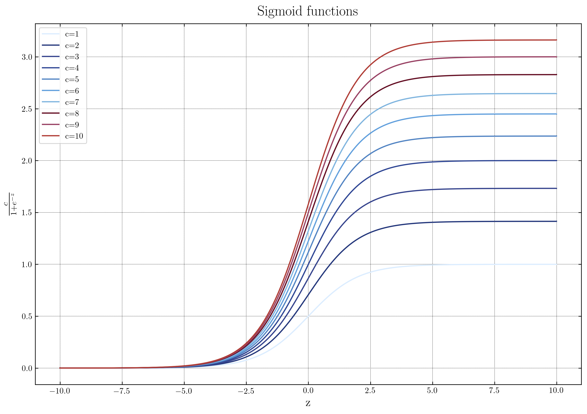
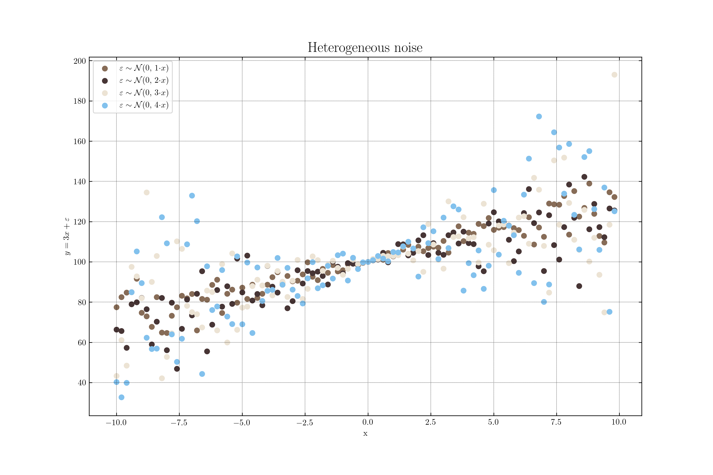
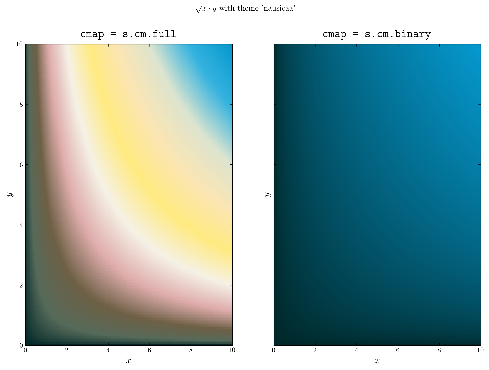
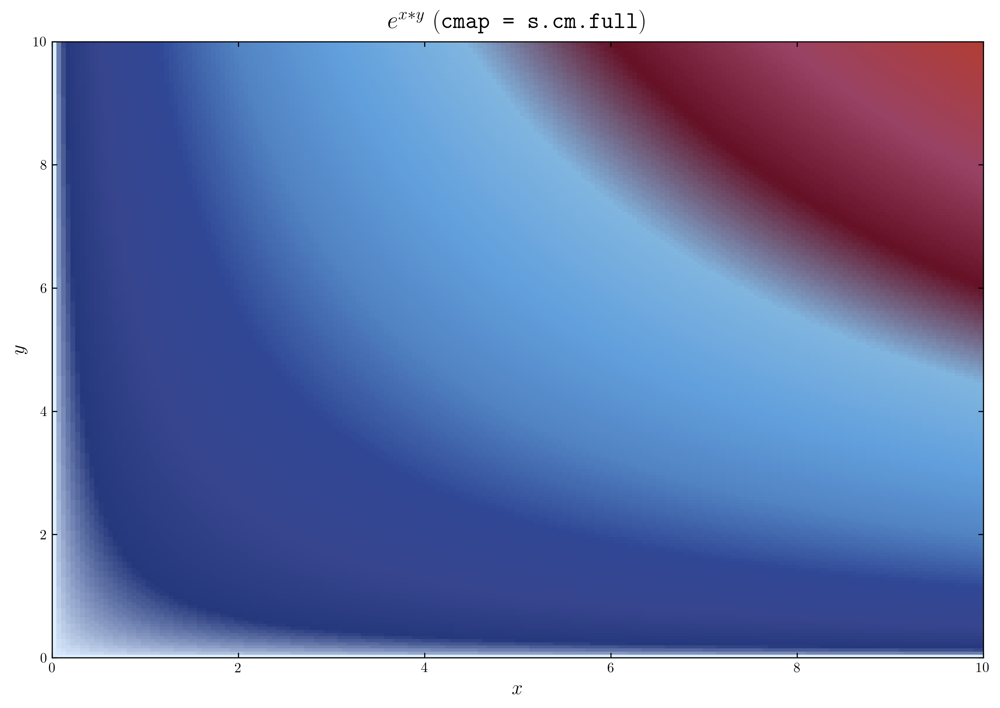

# pretty

This is my attempt at a simple, yet usable matplotlib style. So far it's just a few classes, the most important being `style_classic` which produces relatively neutral figures. Simply call the class at the beginning of your script, and it will update the rcParams needed. You can also use the class interactively. A full list of functions and classes is

* class `style_classic` - sets the classic style shown below
* function `style_reset` - resets the style to the default matplotlib color_options.
* class `style_modern` - under development.

# Installation
This package can be installed either by cloning the repo and running `pip install .` in the root folder, or by running `pip install git+git://github.com/KristianUrupLarsen/pretty.git`


# Colorschemes
There is a number of colorschemes available, all based on the ghibli-studio inspired schemes shown [here](https://www.hotfootdesign.co.uk/white-space/the-colour-palettes-of-studio-ghibli-animations-by-designer-hyo-taek-kim/). Available schemes are


* `classic` (v1 matplotlib colors)
* `castle_in_the_sky`
* `kiki_delivery_service`
* `the_wind_rises`
* `totoro`
* `princess_mononoke`
* `nausicaa`
* `ponyo`

# `style_classic` examples
 Here are some examples of what can be made with `style_classic`:

## Sigmoids
This figure uses the _ponyo_ colorscheme, and is otherwise fully standard settings. The code required to produce the figure is

```python
style_classic('ponyo')

def sigmoid(z, c):
    return c/(1 + np.exp(-z))
sig_fn = np.vectorize(sigmoid)

x = np.arange(-10, 10, .01)
y =  sig_fn(x, 3)

for c in range(1,11):
    plt.plot(x,sig_fn(x, np.sqrt(c)), label = 'c=' + str(c))
plt.title('Sigmoid functions')
plt.legend()
plt.ylabel(r"$\frac{c}{1 + e^{-z}}$")
plt.xlabel('z')

```

 <p align="center">
 
 </p>  


## Heterogeneous errors scatterplot
This also features the `style_classic` function, but uses the (default) _totoro_ color scheme. The code used is

```python
style_classic('totoro')

x = np.arange(-10,10,0.2)
y = 3*x

for c in range(1,5):
    plt.scatter(x,y + np.random.normal(int(20/0.2), scale = c*abs(x)), label = r"$\varepsilon \sim \mathcal{N}(0, \ $" + str(c) + "$\cdot x)$")
plt.legend()
plt.xlabel('x')
plt.ylabel(r"$y = 3x + \varepsilon$")
plt.title('Heterogeneous noise')
plt.savefig('example_figures/hetero.png')
plt.show()
```

<p align="center">

</p>  


## Colormaps (interactive usage)
We can convert all available color schemes into either a multilevel or binary colormap like so:

```python
s = style_classic('nausicaa')

x = np.linspace(0,10, 200)
y = np.linspace(0,10, 200)

def f(x, y):
    return np.sqrt(x*y)

X, Y = np.meshgrid(x,y)
Z = np.zeros(X.shape)

for i in range(X.shape[0]):
   for j in range(X.shape[0]):
       Z[i,j] = f(X[i,j],Y[i,j])


f, (ax1, ax2) = plt.subplots(1,2, sharey = True)
ax1.pcolor(X, Y, Z, cmap = s.cm.full)
ax1.set_xlabel(r"$x$")
ax1.set_ylabel(r"$y$")
ax1.set_title(r"\texttt{cmap = s.cm.full}")

ax2.pcolor(X, Y, Z, cmap = s.cm.binary)
ax2.set_xlabel(r"$x$")
ax2.set_ylabel(r"$y$")
ax2.set_title(r"\texttt{cmap = s.cm.binary}")

plt.suptitle(r"$\sqrt{x\cdot y}$ with theme 'nausicaa'")

plt.savefig('example_figures/colormaps.png')
plt.show()
```

<p align="center">

</p>  


## Using `with` and `pretty`

the pretty style classes support `with` in case you only want to use the style for a
specific piece of code. As an example consider

```python
with style_classic('ponyo') as s:

    f, ax1 = plt.subplots(1,1)
    ax1.pcolor(X, Y, Z, cmap = s.cm.full)
    ax1.set_xlabel(r"$x$")
    ax1.set_ylabel(r"$y$")
    ax1.set_title(r"$e^{x*y}$ (\texttt{cmap = s.cm.full})")

    plt.savefig('example_figures/colormaps_with.png')
    plt.show()
```


<p align="center">

</p>  

# Acknowledgements
The color schemes are originally found [here](https://github.com/carolinethomson/GhibliColour).
